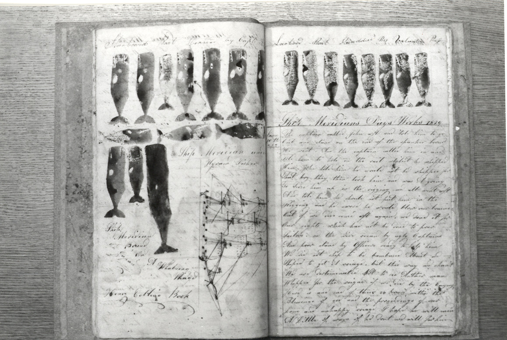

# LogBook

**A simple web application for activity tracking and event aggregation.**

[][whale_log.jpg]

## About

District Data Labs is a data company after all, so it makes sense that we like to track, record, and measure _everything_ about what we do. This simple web application allows us to see email sign-ups, course attendance, teaching patterns, and more! We originally kept everything in a single spreadsheet, but that got a little long - this app intends to help us put everything into a database and analyze it on demand.

### Contributing

LogBook is open source, but because this is an District Data Labs project, we would appreciate it if you would let us know how you intend to use the software (other than simply copying and pasting code so that you can use it in your own projects). If you would like to contribute (especially if you are a student or research labs member at District Data Labs), you can do so in the following ways:

1. Add issues or bugs to the bug tracker: [https://github.com/DistrictDataLabs/logbook/issues](https://github.com/DistrictDataLabs/logbook/issues)
2. Work on a card on the dev board: [https://waffle.io/DistrictDataLabs/logbook](https://waffle.io/DistrictDataLabs/logbook)
3. Create a pull request in Github: [https://github.com/DistrictDataLabs/logbook/pulls](https://github.com/DistrictDataLabs/logbook/pulls)

If you are a member of the MCL group, you have direct access to the repository, which is set up in a typical production/release/development cycle as described in _[A Successful Git Branching Model](http://nvie.com/posts/a-successful-git-branching-model/)_. A typical workflow is as follows:

1. Select a card from the [dev board](https://waffle.io/DistrictDataLabs/logbook) - preferably one that is "ready" then move it to "in-progress".

2. Create a branch off of develop called "feature-[feature name]", work and commit into that branch.

        ~$ git checkout -b feature-myfeature develop

3. Once you are done working (and everything is tested) merge your feature into develop.

        ~$ git checkout develop
        ~$ git merge --no-ff feature-myfeature
        ~$ git branch -d feature-myfeature
        ~$ git push origin develop

4. Repeat. Releases will be routinely pushed into master via release branches, then deployed to the server.

### Name Origin

In the early days of sailing ships, the ship's records were written on shingles cut from logs. These shingles were hinged and opened like a book. The record was called the "log book." Later on, when paper was readily available and bound into books, the record maintained it name.

### Attribution

The image used in this README, ["Whaling Log Book"][whale_log.jpg] by [the Providence Public Library](https://www.flickr.com/photos/ppl_ri_images/) is licensed under [CC BY-NC-ND 2.0](https://creativecommons.org/licenses/by-nc-nd/2.0/)

<!-- References -->
[travis_img]: https://travis-ci.org/DistrictDataLabs/logbook.svg
[travis_href]: https://travis-ci.org/DistrictDataLabs/logbook
[waffle_img]: https://badge.waffle.io/DistrictDataLabs/logbook.png?label=ready&title=Ready
[waffle_href]: https://waffle.io/DistrictDataLabs/logbook
[whale_log.jpg]: https://flic.kr/p/7aBnY8
